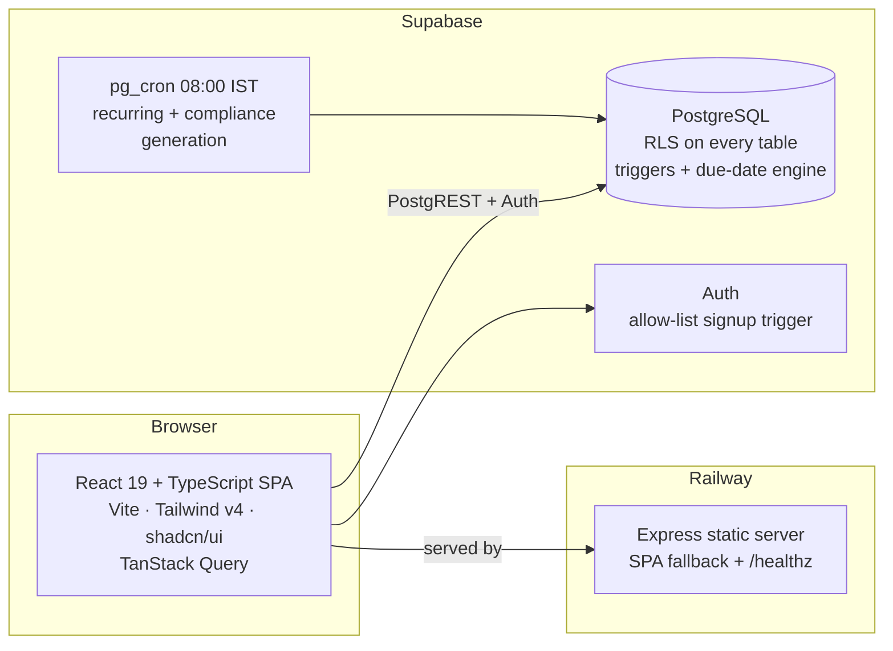

# Practice Management & Compliance Tracker for a CA Firm

**ICAI AI Level 2 — Capstone Project**
*Built for and deployed at Aggarwal Samir & Co, Chartered Accountants*

A full practice-management system for an Indian CA firm: work-stage tracking for
every job in the office, and a compliance engine that generates statutory tasks
(GST, Income Tax, TDS, ROC, Labour) by itself every morning — per client, per
GSTIN, with correct Indian due dates — so nothing depends on somebody
remembering.

This is not a demo. It runs the author's own firm in production
(React + Supabase + Railway), and this repository is the complete,
credential-free source with first-time setup instructions in
[SETUP.md](SETUP.md).

---

## The problem it solves

A CA firm's work has two natures, and most tools handle only one:

1. **Recurring statutory work** — GSTR-3B every month, TDS returns every
   quarter, audit and ROC filings every year. Predictable, dated, dangerous to
   miss. Nobody should have to *create* these tasks; they should exist by
   themselves.
2. **Everything else** — notices, registrations, certificates, bookkeeping,
   advisory, internal jobs. Unpredictable, assigned person-to-person, and the
   partner's real question is never "how many hours did this take" but
   **"what is stuck, at which stage, and for whom?"**

The system models both, on one board, with one login per staff member.

## Feature tour — how it works

### Work stages, not timesheets
Every task sits in exactly one stage:
`01 Assigned but not started → 02 In progress → 03 Need Help → 04 Completed`
(plus `05 Dropped`). Stages live in a database master, so the firm can rename
or extend them without touching code. Every stage change is recorded with who
and when, and the system tracks **days-in-stage** — the metric that exposes
stuck work.

- **Status Board** — pivot of pending work: Client × Stage, Group × Stage,
  Staff × Stage, Category × Stage. Click any number to drill into the tasks.
- **Board** — kanban with drag-and-drop between stages (plus a per-card menu
  for phones). Each card shows client, badges, due state, days-in-stage and
  the latest progress comment with its author.
- **Need Help queue** — moving a task to stage 03 *requires* a note saying
  what the blocker is; the queue shows blocked work longest-waiting first,
  with one-click Unblock.
- **Client Status** — a printable per-client sheet of every job and its stage.

### The compliance engine
A rule catalogue of 71 Indian compliances (seeded from a spreadsheet the firm
already maintained) with real due-date rules: monthly day-rules
(GSTR-3B → 20th of following month), explicit quarterly schedules
(TDS 24Q → 31 Jul / 31 Oct / 31 Jan / 31 May), half-yearly, fixed annual
dates, and AGM-anchored ROC filings with provisional dates.

Per client, staff **tick** which compliances apply. GST rules generate **per
GSTIN** (a client's registrations are kept under the client, auto-synced from
the client master). Every morning at 8:00 IST, a database cron job creates the
tasks that have come within their visibility window — monthly items 10 days
before due, annual items 2 months before — idempotently, so re-running never
duplicates. Completing a compliance task captures the **statutory filing date**
and an optional acknowledgment link.

Event-driven compliances (DIR-12, CHG-1, PAS-3…) are deliberately *not*
generated — they arise from events, so they are created manually from the task
catalogue when the event happens.

The rule catalogue itself is managed inside the app (an admin-only **Compliance
Rules** screen): a new rule or a due-date change — CBDT extends a deadline
every year — is a form that speaks CA language ("monthly, day of following
month"; "fixed date per quarter") and composes the engine fields, not a SQL
file. Annual rules generate the filing season actually running (the previous
FY's return, due this year), not a far-future instance.

### Recurring internal work
The same morning job generates the firm's own recurring work (bookkeeping,
MIS, billing) from standing instructions: pick a job, a client, a person and a
periodicity (daily / weekly / monthly / quarterly / half-yearly / annual) —
one instance per cycle appears by itself. A repeating job can be created
straight from the Add Task dialog ("Repeats: daily…"), which builds the
standing schedule and this cycle's first task in one save; each schedule
carries its own display name ("NCPL Daily stock entry") and a checklist that
lands on every generated task.

### Open assignment with an audit trail
Anyone can create and assign tasks — to themselves or a colleague — because a
partner should not be a bottleneck. Control comes from **history, not locks**:
the assigner is recorded unfakeably, due-date changes are logged
("extended from X to Y by Z on date") in the task's history, and only the
original assigner or an admin can reassign.

### Guard rails that live in the database
- First user to register becomes admin; every later signup must be
  pre-authorised by email (an allow-list enforced by a trigger on
  `auth.users`).
- Row-level security on every table: staff see their own work and what they
  assigned; admins see everything. The API enforces this even if the UI is
  bypassed.
- Compliance ticks: any staff may **add**; only an admin may **remove** or
  change a start date — so a statutory filing cannot silently stop generating.
  A red banner names any tick that will generate nothing (no assignee, or a
  GST rule on a client without a GSTIN).

### Quality-of-life
Bulk client import from a validated Excel template (with a preview of every
row before anything is written), CSV export, sortable columns, self-service
password reset and change, per-client groups (family/business groups pivot on
the Status Board), an instant-startup local cache, and full mobile support.

## Architecture



The deliberate design decision: **the database owns every rule.** Signup
gating, role checks, stage bookkeeping, reassignment rights, due-date
computation and task generation are all SQL — policies, triggers and
functions. The frontend is a thin, fast client; calling the API directly gets
you exactly the same rules.

## Repository layout

```
src/                 React application
  pages/             one file per screen (status board, kanban, tasks, clients…)
  components/        auth provider, route guards, shared UI, dialogs
  hooks/             data layer (TanStack Query over PostgREST)
  lib/               supabase client, constants, helpers
  types/db.ts        hand-written mirror of the SQL schema
supabase/            the entire backend: 20 SQL files, run in order (see SETUP.md)
server.js            production server for Railway
scripts/check-env.js fails the build loudly if Supabase config is missing
public/              favicon + the client bulk-upload Excel template
```

## How this was built

The project was designed and implemented end-to-end with **Claude (Anthropic)
as an AI pair-programmer** inside Claude Code, as a demonstration of
AI-assisted software delivery for the ICAI AI programme: requirements were
specified conversationally by a practising CA, the AI wrote and revised the
schema, application code and deployment configuration, and every feature was
verified against the live system before the next was started. Total cost of
tooling: one Supabase free project and one small Railway service — no
proprietary practice-management licence.

## Getting started

Follow **[SETUP.md](SETUP.md)** — first-time Supabase setup (20 SQL files in
order), authentication settings, local development, and Railway deployment.
